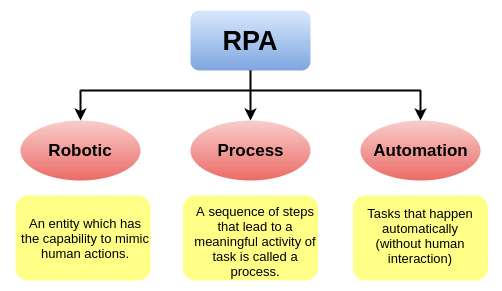

# Blue Prism Interview Questions & Answers
> Click :star:if you like the project.
 

### Table of Contents

| No. | Questions |
| --- | --------- |
|1  | [What is Blue Prism?](#what-is-blue-prism) |
|2  | [What does RPA stand for?](#what-does-rpa-stand-for) |
|3  | [What are the major features of Blue Prism?](#what-are-the-major-features-of-blue-prism) |
|4  | [What are the main components of the RPA Blue Prism?](#what-are-the-main-components-of-the-rpa-blue-prism) |
|5  | [What is the role of VBO in Blue Prism?](#what-is-the-role-of-vbo-in-blue-prism) |
|6  | [What are the types of security options available in the Blue Prism tool?](#what-are-the-types-of-security-options-available-in-the-blue-prism-tool) |
|7  | [Define these terms: IPA, PDD, FRQ, SDD, OID, PDI, and ODI.](#define-these-terms-ipa-pdd-frq-sdd-oid-pdi-and-odi) |
|8  | [Explain work queues in the context of RPA Blue Prism](#explain-work-queues-in-the-context-of-rpa-blue-prism) |
|9  | [How can we configure priorities for work queues?](#how-can-we-configure-priorities-for-work-queues) |
|10  | [Why do we use Tags in Blue Prism?](#why-do-we-use-tags-in-blue-prism) |
|11  | [Define Application Modeller.](#define-application-modeller) |
|12  | [What is the role of the Attach option in Blue Prism?](#what-is-the-role-of-the-attach-option-in-blue-prism) |
|13  | [What is defined by dynamic match type?](#what-is-defined-by-dynamic-match-type) |
|14  | [Why do we use the 'Preserve' checkbox option in Blue Prism?](#why-do-we-use-the-preserve-checkbox-option-in-blue-prism) |
|15  | [How can we stop a process that is running in the Control Room?](#how-can-we-stop-a-process-that-is-running-in-the-control-room) |
|16  | [Why do we use the Wait stage in Blue Prism?](#why-do-we-use-the-wait-stage-in-blue-prism) |
|17  | [Explain Control Room.](#explain-control-room) |
|18  | [What is the main difference between Match Index and Match Reverse options in Blue Prism?](#what-is-the-main-difference-between-match-index-and-match-reverse-options-in-blue-prism) |
|19  | [Explain the connector and its types in the context of Blue Prism.](#explain-the-connector-and-its-types-in-the-context-of-blue-prism) |
|20  | [What is meant by the Recover stage in Blue Prism?](#what-is-meant-by-the-recover-stage-in-blue-prism) |
|21  | [Define System Unavailable Exception and Mark Exception.](#define-system-unavailable-exception-and-mark-exception) |
|22  | [What are the modes for object spying in Blue Prism?](#what-are-the-modes-for-object-spying-in-blue-prism) |
|23  | [What is Blue Prism Architecture?](#what-is-blue-prism-architecture) |

   
1. ### What is Blue Prism?

	Blue Prism is one of the leading software development companies in the automation area. It is a UK-based company helping organizations with one of its popular RPA tools, Blue Prism. The term RPA, which is an acronym of **'Robotic Process Automation'**, was first introduced by the Blue Prism group.

	The Blue Prism tool is primarily designed to create software robots (also called bots). These software robots are nothing but a set of pre-defined commands that help automate rule-based, repetitive tasks, and eliminate or reduce humans work.

   **[⬆ Back to Top](#table-of-contents)**

2. ### What does RPA stand for?

	RPA is the short form of ***Robotic Process Automation***. RPA is a special kind of automation technique in which software robots perform a human's tasks. These tasks generally include repetitive, rule-based, and manual processes. The technique helps organizations automate their digital processes across various applications and systems without changing the existing systems or IT infrastructure.

* **Robotic:** Set of codes that acts like a robot and mimic human actions.

* **Process:** Sequence of steps that creates a meaningful activity is known as the process.

* **Automation:** The process performed by software robots without human interaction.

  
	
   **[⬆ Back to Top](#table-of-contents)**

3. ### What are the major features of Blue Prism?

	The main features of RPA Blue Prism are listed below:

	* Robust
	* Accurate
	* Secure
	* Scalable and Resilient
	* Consistent
	* Powerful Analytics
	* Data Abstraction with Security
	* Cloud Support
	* Smart Execution
	* Availability of Multiple Formats
	* Multi-platform Support

   **[⬆ Back to Top](#table-of-contents)**
   
4. ### What are the main components of the RPA Blue Prism?

	There are several components present in the Blue Prism tool. However, the main components are:

	* Process Studio
	* Object Studio
	
	**Process Studio:** A process studio is defined as the area in the Blue Prism tool that allows developers to create process diagrams for the processes to be automated. The process studio consists of various options, such as variables, control loops, object calls, and business logic, etc. Every process created here includes the Main Page that is executed first.

	**Object Studio:** To automate most business processes, organizations must establish communication with external software or applications. Since Process Studio does not allow this, Object Studio is included in Blue Prism to perform this functionality. Object Studio allows developers to create VBO (Visual Business Objects).

   **[⬆ Back to Top](#table-of-contents)**

5. ### What is the role of VBO in Blue Prism?
	
	VBO is a short form of **"Visual Business Objects"**. These are the diagrammatic programs that can be created in Object Studio.

	These visual business objects provide an interface that can interact with external applications. The interface cannot be formed by using Process Studio; it is only generated using the environment given in the Object Studio within the Blue Prism tool.

   **[⬆ Back to Top](#table-of-contents)**

6. ### What are the types of security options available in the Blue Prism tool?

	There are mainly three different types of security controls available in RPA Blue Prism, such as User, Credentials, and Options.

	**Security Type	       Used for**
	* **User :**	Assigning new user information.
	* **Credentials:**	Storing secret information.
	* **Options:**	Assigning rules for setting passwords.

	Besides, Blue Prism also offers role-based access management for increased security. It is used to assign a specific role to any particular user. The user cannot perform actions other than assigned ones. Apart from this, the administrator also gets control over user activities. For example, an admin can check when a user has logged in into the Blue Prism, started or deleted process, and many other activities.
	
   **[⬆ Back to Top](#table-of-contents)**
   
7. ### Define these terms: IPA, PDD, FRQ, SDD, OID, PDI, and ODI.
	
	* **IPA:** It is a short form of *'Initial Process Analysis'*. It is a high-level analysis of the entire process solution. It contains pre-requisites, efforts, and proposed solutions for the development along with the production environment requirements.

	* **PDD:** It is a short form of *'Process Definition Document'*. The document contains the manual processes that are to be automated. It consists of a process diagram and detailed descriptions of all the stages based on the organization's requirements.

	* **FRQ:** It is a short form of *'Functional Requirements Questionnaire'*. It includes the checklist of the necessary information as well as some other areas that need consideration.
									 
	* **SDD:** It is a short form of *'Solution Design Document'*. PDD and FRQ act as input for SDD. The primary aim of SDD is to automate the processes described in PDD. It ensures that Blue Prism provides an end-to-end solution.
									
	* **OID:** It is a short form of *'Operational Impact Document'*. Once the automation solution is provided to the client, there will be several responsibilities to operate appropriately. The OID contains the information required to inform the client operation team of their responsibilities.
									
	* **PDI:** It is a short form of *'Process Design Instruction'*. It is generally defined as the blueprint to design/develop automation processes. It also contains such type of low-level information that is not added in SSD. This approach is mainly used to achieve increased clarity throughout the project.
									
	* **ODI:** It is a short form of *'Object Design Instruction'*. It is a blueprint that helps in the development of business objects. 
	
   **[⬆ Back to Top](#table-of-contents)**
   
8. ### Explain work queues in the context of RPA Blue Prism	

	Work Queues in Blue Prism are generally implemented to break large volumes of work into multiple small volumes. Additionally, it is said to be the most effective way for the deployments of bots. It is because multiple bots are implemented to decrease the overall time consumption during the separation of large volumes of work to small volumes.
	
   **[⬆ Back to Top](#table-of-contents)**	

9. ### How can we configure priorities for work queues?

	To configure the priority, we need to follow these steps:

	*We are first required to add an item in the corresponding queue with the help of the existing 'Add to Queue' action.
	*Then, we are required to work with the existing queue item. It will set the start-priority of the created process.
	*Once the priority of the item is added, we can repeat the same with more items. It should be noted that the item's priority is unchangeable once added to the queue.
	
   **[⬆ Back to Top](#table-of-contents)**
   
10. ### Why do we use Tags in Blue Prism?

	Tags are defined as the keywords of terms assigned to the work queue items. They are generally used when we want to retrieve the next item from the particular work queue. There is also an option to filter these items using the Tag Filter input parameter under 'Get Next item' action. Using this, we can easily retrieve the required item from the work queue in the presence or absence of any specific tag.
	
   **[⬆ Back to Top](#table-of-contents)**
   
11. ### Define Application Modeller.

	Application Modeller is defined as the embedded capability inside the Object Studio. The application modeller's primary function is to provide an environment to create application models within the Object Studio. It contains several basic configurations that help in interacting and communicating with the existing applications and UI elements. These elements are identified by Blue Prism software robots based on pre-defined attributes. The elements are further configured and updated to make them unique for every single element. The software bots can further interact with these elements and perform specified operations over them.	
	
   **[⬆ Back to Top](#table-of-contents)**
   
12. ### What is the role of the Attach option in Blue Prism?

	The Attach option in Blue Prism is primarily responsible for identifying an application that is being used. We are required to enter the appropriate value that will be used to identify the application, such as the name of a particular process or window title.
	
   **[⬆ Back to Top](#table-of-contents)**
   
13. ### What is defined by dynamic match type?

	The Dynamic Match Type is generally defined as the parameter that must be entered within the stages of any process. This is a mandatory input parameter and should be entered using elements. The primary purpose of a dynamic match type is to allow users to specify the value manually for an attribute from the process diagram instead of using default one from Application Modeller.
	
   **[⬆ Back to Top](#table-of-contents)**
   
14. ### Why do we use the 'Preserve' checkbox option in Blue Prism?

	The Preserve checkbox option is mainly used to disable Exception Type and Exception Details fields within the Blue Prism tool. Besides, when the Preserve checkbox option is selected, the exception is released without the requirement of any other details. That means the existing exception is thrown again. That is why we use the Preserve checkbox option in the Recovery Mode. The recovery mode resides in between the Resume stage and a Recover stage.

	In case if we use the checkbox outside the recovery mode, it will provide an exception	
	
   **[⬆ Back to Top](#table-of-contents)**
   
15. ### How can we stop a process that is running in the Control Room?

	There are two main methods that we can use to stop a running process in the Control Room:

	* By clicking the stop section
	* By selecting the Process Session
	
	Both the above methods help stop any running process immediately. Blue Prism mark such processes as an Exception at Clean-Up to identify that the process could not get completed.

	In case if we are going to use a second method, then we are first required to select a process session. After that, we need to double-click on it. It will display the following two option:

	**Request Stop:** It is used to stop a running process at a configured safe stop.

	**Immediate Stop:** It is used to stop a running process immediately. It acts as the first method, i.e., just like clicking on the Stop section.	
	
   **[⬆ Back to Top](#table-of-contents)**
   
16. ### Why do we use the Wait stage in Blue Prism?

	The Wait stage is used to absorb the system latency and make sure that the process is going through the correct path. Typically, the wait in the starting of any action confirms the correctness of path and results in increased process resilience. The default timeout in the Wait stage is 5 seconds. The process will wait before performing an action until the timeout that the user has specified for the Wait stage upon running the object has passed.

	**Always throw an exception on timeout:** One should not try to retrieve the process through the Wait stage. Besides, one should try an exception and let the process control and handle it. It may restart the system, or retry after an alert, or retry after some time.

	**Always with for the screen to change:** One should use the wait stages after navigating to any stage that might be a cause to update screen. It ensures improved speed without absorbing any latency.
	
17. ### Explain Control Room.

	The Control Room acts like a command center that is mainly used to analyze, control, schedule, and execute automation processes to the digital workforce.

	In simple words, all the components and resources are monitored and controlled with the help of the Control Room. It is a centralized administration system within the Blue Prism that provides detailed statistics of process workflow. It also enables users to monitor the startup and the working of a process via manual approach. Additionally, it helps users to measure the overall performance of processes to ensure proper working.
	
   **[⬆ Back to Top](#table-of-contents)**
   
18. ### What is the main difference between Match Index and Match Reverse options in Blue Prism?
	
	Match Index option is used when we want to search for an element in top-to-bottom order. Besides, the Match Reverse option is used when we want to search for an element in the bottom-to-top order. Once the element is found, the search will be stopped instantly, and all the further duplicates will be ignored.

	These two options are beneficial in cases where we require to find any specific element. Additionally, these attributes reduce the overall searching time. However, these options should be used only when we don't want to find duplicate elements or when duplicate elements are unlikely to be present.	

19. ### Explain the connector and its types in the context of Blue Prism.

	A connector is responsible for handling and managing low-level interactions with the user interface of particular applications. Because users can use different types of user interfaces, therefore, Blue Prism also provides a variety of connector types. Some of the common connector types are explained below:

	**Java Connector:** It is used to work with Java applets, Swing, Oracle, and other JVM based technologies.

	**Windows Connector:** It is used to work with windows based applications interface technologies, such as .NET framework, Visual Basic, PowerBuilder, MFC (Microsoft Foundation Class), and others.

	**Citrix Connector:** It is used to work with applications that use Microsoft Remote Desktop and Citrix technologies.

	**Mainframe Connector:** It is used to work with the mainframe applications by using terminal emulators from different vendors.

	**HTML Connector:** The HTML connector is used to work with HTML, JavaScript, ActiveX controls, and other components of the browser interface.
	
   **[⬆ Back to Top](#table-of-contents)**
   
20. ### What is meant by the Recover stage in Blue Prism?
	
	The Recover stage is helpful during exception-caching. It allows users to create different types of recovery sequences. Once the exception is caught, the Business object or the process is called to be in the recovery mode and indicating the live state of exception.
	
   **[⬆ Back to Top](#table-of-contents)**
   
21. ### Define System Unavailable Exception and Mark Exception.
	
	The System Unavailable Exceptions are the exceptions that are usually found when a user is unable to launch the application. This can happen in scenarios when the application is not responding or when the application crashes. It could be a reason that these unexpected crashes were not considered in the design and development phase.

	Coming to the Mark Exception, it is used to control exception features. It contains two flag inputs, such as Keep Locked and Retry. When any new item is created, the unique ID of this created item is returned to the output parameter using Mark Exception. The Keep Locked flag is generally set to 'True' when there is a requirement to keep the new item under control.

22. ### What are the modes for object spying in Blue Prism?
	Blue Prism has the following modes for object spying:

	* WIN32 Mode
	* Region Mode
	* UI (User Interface) Automation Mode
	* HTML Mode
	* Accessibility Mode	
	
   **[⬆ Back to Top](#table-of-contents)**
   
23. ### What is Blue Prism Architecture?

	 
	 
	* 1 Machine for Blue Prism Database (Microsoft Sql server)
	* 1 Machine for Blue Prism Application Server (Connects to BP Database)
	* 1 or Many Development Machines(Interactive Client in BP terminology) connected Prism to Blue Application Server
	* 1 or Many Bots (Runtime resources in BP terminology) connected to Blue Prism Application Server

	So everything is gets stored in Blue Prism Database (process, objects , users, environment variables etc) and Application server is main component through which bots/developer machine talk to BP database 
	
	
   **[⬆ Back to Top](#table-of-contents)**	